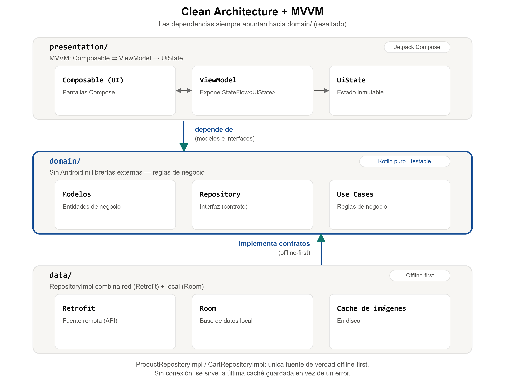
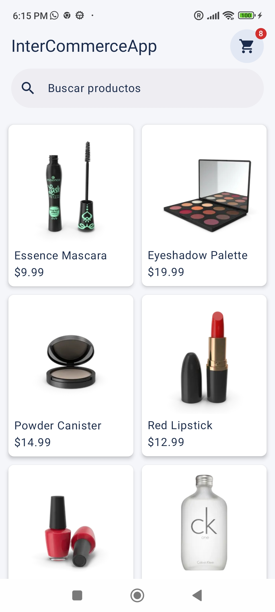
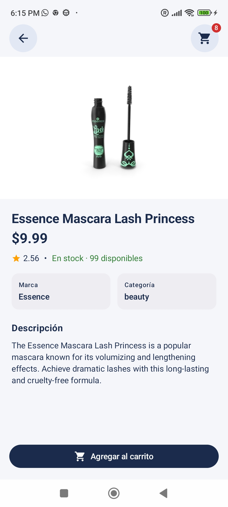
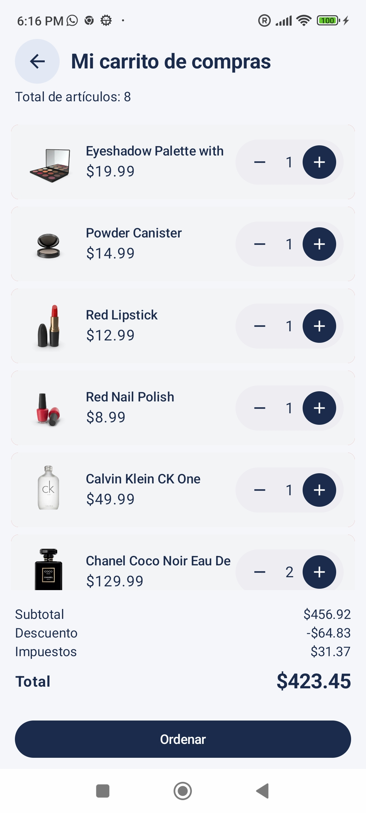
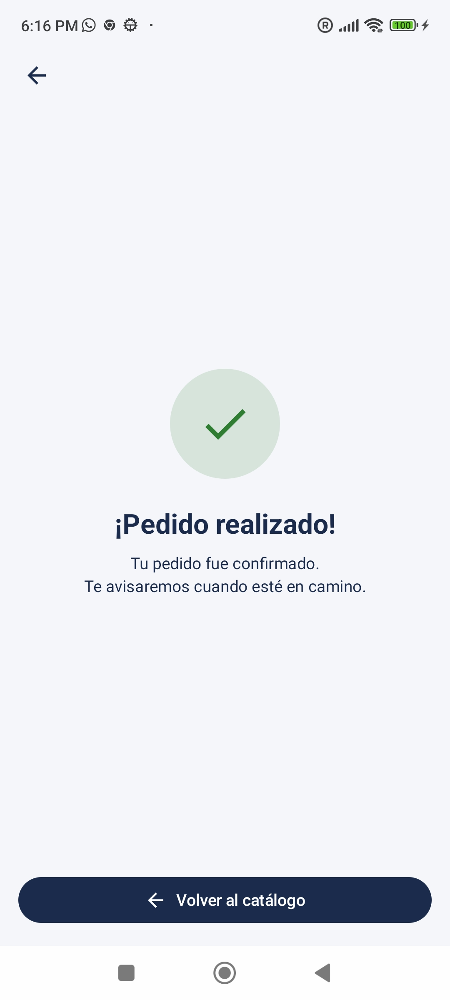

# InterCommerceApp

App de e-commerce para Android construida con Jetpack Compose. Permite explorar un catálogo de
productos, buscar, ver el detalle de un producto, agregarlo al carrito, gestionar las cantidades y
completar un checkout simulado, con soporte para modo offline gracias a un caché local de productos e
imágenes.

Los productos se obtienen de la API pública [DummyJSON](https://dummyjson.com/).

## Arquitectura

El proyecto sigue **Clean Architecture** con tres capas, más **MVVM** dentro de la capa de
presentación:



- **`domain/`** no depende de Android ni de ninguna librería externa: son clases Kotlin puras
  (modelos, interfaces de repositorio, use cases). Esto es lo que se prueba con más facilidad y lo que
  define las reglas de negocio de la app.
- **`data/`** implementa esos contratos: `ProductRepositoryImpl`/`CartRepositoryImpl` combinan una
  fuente remota (Retrofit) y una local (Room) para ofrecer una única fuente de verdad "offline-first" -
  si no hay conexión, se sirve lo último guardado en caché en vez de mostrar un error.
- **`presentation/`** son los `ViewModel` (exponen un único `StateFlow<UiState>` por pantalla) y las
  pantallas en Compose que lo consumen.

**¿Por qué esta arquitectura?**
- **Testabilidad**: al aislar las reglas de negocio (`domain/`) de Android y de la UI, los use cases y
  ViewModels se prueban con JUnit/MockK sin necesitar un emulador.
- **Offline-first real**: el requisito de que el catálogo y el detalle de producto sigan funcionando
  sin conexión (incluyendo las imágenes, guardadas en disco) encaja naturalmente con el patrón
  Repositorio: la UI nunca sabe si el dato vino de la red o del caché.
- **Inyección de dependencias con Hilt**: cada capa se conecta mediante interfaces (`ProductRepository`,
  `CartRepository`), lo que permite reemplazar implementaciones fácilmente en tests.

### Persistencia: por qué Room y no ObjectBox

La app usa **Room** (sobre SQLite) como mecanismo de persistencia local, por encima de alternativas
como ObjectBox:

- **Integración nativa con Coroutines/Flow**: todo el proyecto observa datos de forma reactiva
  (`CartDao.getAll(): Flow<List<CartItemEntity>>`, consumido directamente por `CartViewModel`). Room
  genera esos `Flow` automáticamente a partir de las queries; con ObjectBox habría que adaptar sus
  propios observers al mundo de Coroutines.
- **Verificación en compilación**: las queries se validan contra el esquema en tiempo de compilación
  (vía KSP), detectando errores antes de correr la app.
- **Modelo de datos simple**: sólo hay dos tablas (`products`, `cart_items`) sin relaciones complejas
  ni grafos de objetos grandes, que es donde ObjectBox brilla frente a SQL. Para este alcance, Room
  aporta lo mismo con menos piezas: sin motor nativo adicional, sin `.mdb`, y con herramientas de
  Android Studio (Database Inspector) que lo hacen más fácil de depurar.
- Es además el estándar recomendado por Jetpack, lo que reduce fricción para cualquiera que se sume
  al proyecto.

**Estrategia para mitigar pérdida de datos**

- **Carrito**: `CartDao`/Room es la única fuente de verdad — nunca vive sólo en memoria del
  `ViewModel`. Así sobrevive a rotaciones de pantalla, al proceso muerto por el sistema en background
  y a reinicios de la app.
- **Catálogo y detalle**: patrón *cache-aside* offline-first (ver `ProductRepositoryImpl`). Ante un
  fallo de red se sirve lo último guardado en `ProductDao` en vez de perder lo que el usuario ya veía;
  sólo se propaga un error si tampoco hay nada cacheado.
- **Imágenes**: se descargan una única vez y se guardan en `filesDir` (no `cacheDir`), para que el
  sistema operativo no pueda borrarlas al liberar espacio o cuando el usuario borra la caché de la app
  desde Ajustes.
- **Trade-off conocido**: la base usa `fallbackToDestructiveMigration()`, es decir que un cambio de
  esquema sin migración explícita recrea las tablas y borra el caché local. Hoy es aceptable porque
  `products` y las imágenes son datos siempre recuperables desde la red — pero si el carrito ganara
  complejidad (por ejemplo, pedidos guardados), este sería el primer punto a reemplazar por
  migraciones explícitas para no arriesgar datos que el usuario no pueda recuperar.

### Stack técnico

| Área | Librería | Versión | Uso en el proyecto |
|---|---|---|---|
| UI | [Jetpack Compose](https://developer.android.com/jetpack/compose) + Material 3 | BOM 2026.02.01 | Toda la UI declarativa de la app |
| Navegación | [Navigation Compose](https://developer.android.com/jetpack/compose/navigation) | 2.9.8 | Rutas tipadas entre pantallas con `kotlinx.serialization` |
| Inyección de dependencias | [Hilt](https://dagger.dev/hilt/) | 2.60.1 | Provee repositorios, DAOs y clientes de red a ViewModels |
| Red | [Retrofit](https://square.github.io/retrofit/) + [OkHttp](https://square.github.io/okhttp/) | 3.0.0 / 5.4.0 | Cliente HTTP para consumir la API de DummyJSON |
| Serialización | [kotlinx.serialization](https://github.com/Kotlin/kotlinx.serialization) | 1.11.0 | Parseo JSON de las respuestas de red |
| Persistencia local | [Room](https://developer.android.com/training/data-storage/room) | 2.8.4 | Caché de productos, carrito y rutas de imágenes descargadas |
| Imágenes | [Coil](https://coil-kt.github.io/coil/) | 2.7.0 | Carga y caché de imágenes de producto |
| Concurrencia | Kotlin Coroutines + Flow | 1.11.0 | Streams reactivos entre repositorios y ViewModels |
| Tests | JUnit4, [MockK](https://mockk.io/), [Turbine](https://github.com/cashapp/turbine) | 4.13.2 / 1.14.11 / 1.2.1 | Tests unitarios de use cases, repositorios y ViewModels |

## Pantallas

| Pantalla | Descripción |
|---|---|
| **Catálogo** | Grid de productos con paginación infinita y buscador. Header con acceso al carrito (icono con badge del total de items). Si no hay conexión, muestra un banner y sirve los productos ya cacheados. |
| **Detalle de producto** | Imagen, precio, rating, disponibilidad de stock, marca/categoría y descripción del producto. Botón para agregarlo al carrito (con vibración y confirmación) y acceso directo al carrito. |
| **Carrito / Checkout** | Lista de items con miniatura, control de cantidad y swipe para eliminar. Resumen con el total y botón "Ordenar". |
| **Pedido confirmado** | Pantalla de éxito tras completar el pedido: vacía el carrito y ofrece volver al catálogo. |

| Catálogo | Detalle de producto |
|:---:|:---:|
|  |  |

| Carrito / Checkout | Pedido confirmado |
|:---:|:---:|
|  |  |

## Cómo ejecutar la app

**Requisitos**
- Android Studio compatible con AGP 9.2 / Kotlin 2.2 (por ejemplo, Android Studio Narwhal o superior).
- JDK 17 o superior (lo usa Gradle/AGP para compilar; el bytecode de la app apunta a Java 11).
- Un emulador o dispositivo físico con Android 7.0 (API 24) o superior.
- Conexión a internet en el primer arranque (para traer el catálogo desde DummyJSON). Una vez
  cacheado, el catálogo y el detalle de producto funcionan sin conexión.

No requiere API keys ni configuración adicional más allá del SDK de Android en `local.properties`.

**Pasos**
1. Clonar el repositorio y abrirlo en Android Studio (`File > Open`).
2. Esperar a que Gradle sincronice — el proyecto incluye su propio wrapper (`gradlew` / `gradlew.bat`),
   no hace falta instalar Gradle aparte.
3. Ejecutar con el botón ▶ Run sobre un emulador/dispositivo, o desde la terminal:
   ```bash
   ./gradlew installDebug
   ```

## Tests

Cobertura de tests unitarios (JUnit + MockK) en `data/`, `domain/` y `presentation/`: mappers,
repositorios, use cases y ViewModels (incluyendo estados de carga, error y offline). No se incluyen
tests de instrumentación/UI.

Correr toda la suite:

```bash
./gradlew test
```

Para iterar más rápido durante desarrollo (sólo variante debug, sin compilar la variante release):

```bash
./gradlew testDebugUnitTest
```
